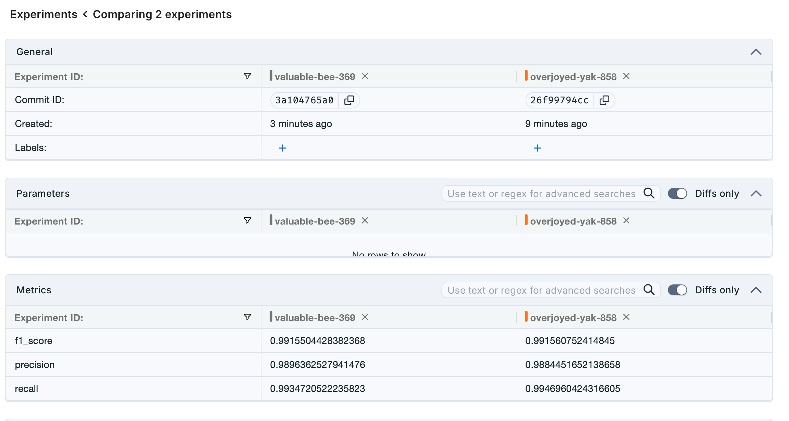
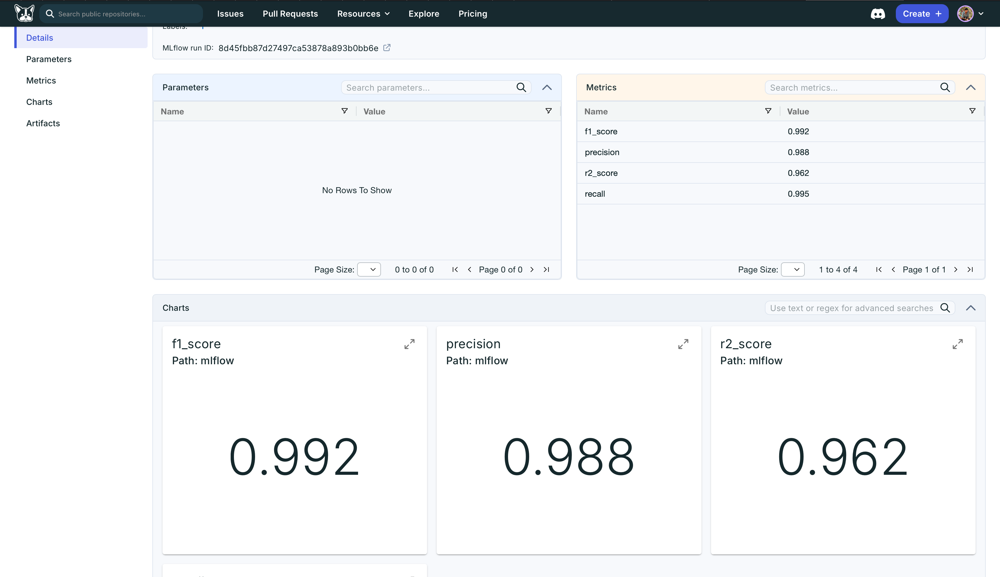
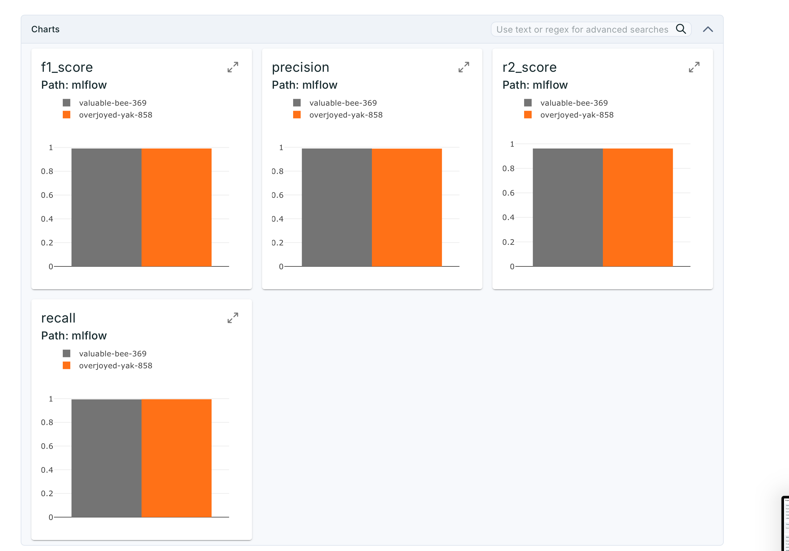
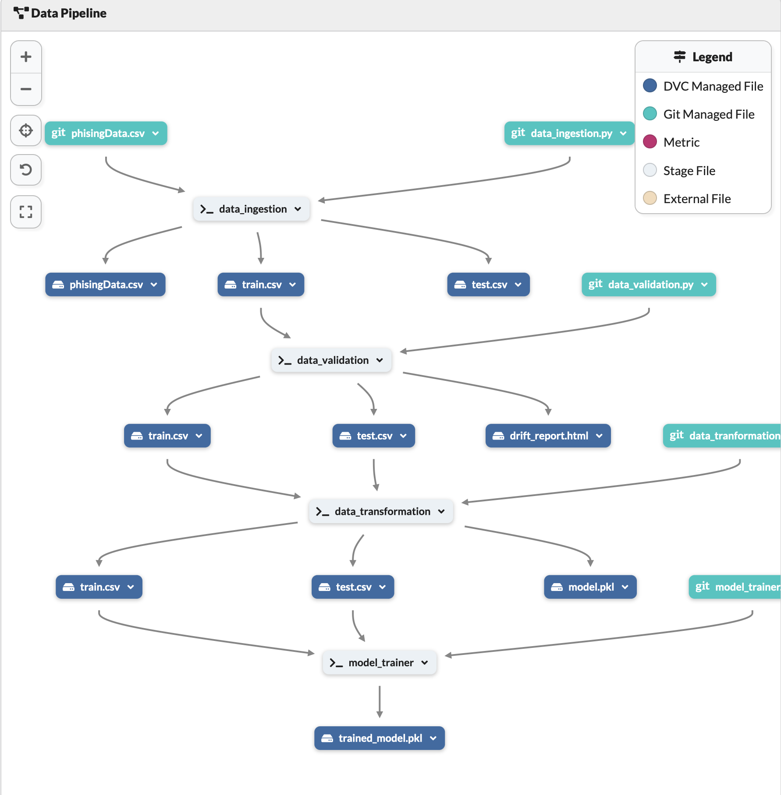

# 🔐 Network Security 🛡️ | End-to-End MLOps Pipeline 🚀

Welcome to the **Network Security Threat Detection** project — an end-to-end implementation of a production-grade ML pipeline integrating modern **MLOps tools** including **MLflow, DVC, Docker, GitHub Actions, CI/CD, and Dagshub**.

> 💡 Designed for real-world use cases like intrusion detection using machine learning — deployable, trackable, reproducible, and scalable!

---

## 📊 Problem Statement

In this project, we tackle the problem of **network intrusion detection** using ML algorithms. Our goal is to build a pipeline that:

- Ingests network traffic data
- Preprocesses and extracts meaningful features
- Trains a model to classify normal vs suspicious activity
- Deploys the model with full **CI/CD** and **MLOps support**

---

## 🧪 ML Pipeline Components

### 🛠️ Data Versioning with DVC

- ✅ Tracks raw and processed datasets
- ✅ Pipeline defined in `dvc.yaml`
- ✅ Remote storage: [DagsHub](https://dagshub.com)

### 🧪 Experiment Tracking with MLflow

- 🎯 Log metrics, parameters, and artifacts
- 📊 Compare multiple models & runs visually
- 🧠 Integrate with sklearn pipeline easily

### 🐳 Containerization with Docker

- Reproducible environments
- Easy deployment across dev/stage/prod

### 🔄 CI/CD with GitHub Actions

- Every `push` or `PR` triggers:
  - ✅ Code linting
  - ✅ Unit tests
  - ✅ DVC pipeline execution
  - ✅ MLflow tracking
  - ✅ Docker build & push

### 📡 Deployment Ready

- Containerized inference API (FastAPI or Flask)
- Ready for deployment on **AWS/GCP/Azure** or **Heroku**

---

## 🚀 Tools & Technologies Used

| Category           | Tools                                |
| ------------------ | ------------------------------------ |
| 👨‍💻 Programming     | Python, Pandas, NumPy, Scikit-learn  |
| 📦 ML Lifecycle    | MLflow, DVC, Dagshub, Hydra          |
| 🧱 MLOps/CI-CD     | GitHub Actions, Docker, YAML, Pytest |
| 🌐 Visualization   | Matplotlib, Seaborn, MLflow UI       |
| 🔁 Version Control | Git, GitHub                          |

---

## ⚙️ Run the Project Locally

```bash
# 1. Clone the repo
git clone https://github.com/yourusername/network-security-mlops.git
cd network-security-mlops

# 2. Set up DVC
dvc pull   # Pull data from remote storage
dvc repro  # Reproduce the entire pipeline

# 3. Track experiments
mlflow ui  # Launch MLflow dashboard at http://127.0.0.1:5000

# 4. Build Docker container
docker build -t network-mlops-app .
docker run -p 8000:8000 network-mlops-app

```

## 📊 Dataset Used

This is the dataset used to build and train the machine learning model in this project.  
Download it from the link below:

[](https://drive.google.com/uc?export=download&id=1RyfjeqoM7QWzgOoCKi3YWvT9fYPjZ9lh)

---

# 📈 MLflow Example Output

- 🔢 Accuracy, Precision, Recall, ROC Curve
- 📁 Model artifact: RandomForestClassifier.pkl
- 📊 Visual run comparison dashboard

---

## Monitoring and Experiment Tracking

For seamless monitoring of the project’s DVC pipelines and MLflow experiments, kindly visit the Dagshub repository linked below:


### 📷 MLflow Tracking UI

Here's a preview of how the experiments and metrics are logged in MLflow:



### 🔁 Model Metrics

Below is the Models metrics That have used in this model traning



### 📊 Comparision Charts

Below is a visualization of metrics like accuracy, precision, recall over different runs:



### 🔁 DVC Pipeline from Dagshub

DVC pipeline stages and tracking interface hosted on Dagshub:

## 

## 🚧 CI/CD Pipeline (GitHub Actions)

`.github/workflows/mlops.yml`  
Runs the full pipeline on every push:

- ✅ Lint + Tests
- ✅ DVC repro
- ✅ MLflow log
- ✅ Docker image push

---

## 🧠 Future Improvements

- ✨ Add LSTM or Deep Learning models
- 📦 Convert to FastAPI microservice
- 🔐 Add role-based access control for logs
- 📊 Grafana + Prometheus monitoring
- ☁️ Deploy to AWS Sagemaker or GCP AI Platform

---

## 📬 Contact

If you found this project helpful, let’s connect!

- 💼 LinkedIn
- 🐙 GitHub
- ✉️ your.email@example.com

---

## ⭐️ Show your support

If you liked this project, please consider giving it a ⭐️ and sharing with others!

> 🛡️ Empowering network security with reproducible ML pipelines!

---

## 🧰 Project Extensions You Can Use

Would you like me to now generate:

- 📦 Dockerfile – for containerizing the app
- 🔄 .github/workflows/mlops.yml – full CI/CD pipeline with GitHub Actions
- ⚙️ dvc.yaml – for defining your DVC stages (data, preprocess, train, evaluate)
- 📊 mlflow_tracking.py – script to log parameters, metrics, and models to MLflow
- 🖥️ Streamlit or Flask app – for serving your trained model via an interactive web app or API

---

## 🖥️ Model Deployment Options

Choose either of the following options to serve your trained model:

#### 🎨 Streamlit Dashboard

- An interactive web interface to test your model
- Upload CSV or manually enter input features
- See predictions live, with metrics and visualizations

```bash

streamlit run src/app_streamlit.py

```

---

## 🚀 Flask API

- A production-grade REST API endpoint to serve predictions
- Send POST requests with JSON payload
- Easily integrate with any web or mobile frontend

```bash

python src/app_flask.py

```

> 💡 Whether you're demoing the model in a web dashboard (Streamlit) or deploying via API (Flask), this project gives you flexibility to move fast in any real-world environment.

---

---

## 🧪 DEMO & Practice

This project structure and workflow was inspired by **Krish Naik sir’s** teachings on practical MLOps and end-to-end ML deployment.

> 💡 I’ve extended and personalized it with full MLOps integration, CI/CD, and deployment options for real-world use cases in Network Security.

### 🧑‍🏫 Demo Guidance:

You can also explore Krish Naik’s YouTube tutorials on:

- DVC + MLflow
- MLOps project pipelines
- Dockerized ML apps
- Streamlit deployment
- GitHub Actions for CI/CD

▶️ **Practice this project hands-on** by cloning and running each stage step-by-step.  
Contributions are welcome to enhance this open-source solution further!

---

> 💬 _“Learning by doing is the fastest path to mastery.”_ — Thanks to Krish Naik sir for being a constant inspiration to ML learners.

---
